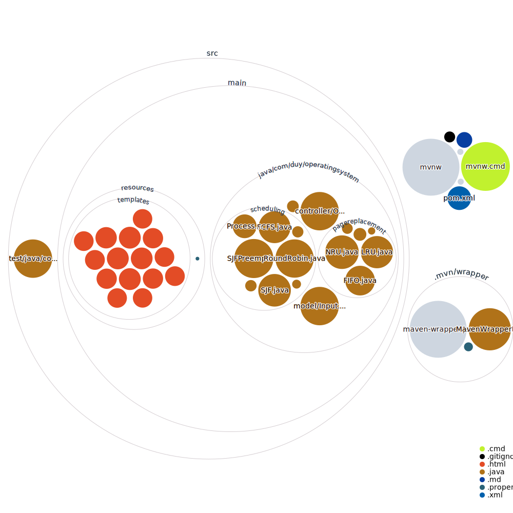

# schedulingpagereplace
# Thuật toán lập lịch và phân trang phiên bản Web

Bao gồm 4 thuật toán lập lịch và 3 thuật toán phân trang trong môn Hệ điều hành.

# Xây dựng 

  - Viêt bằng Java (springboot và thymeleaf)
  - Deploy bằng Heroku.

Bao gồm:

> FCFS
> SJN
> SRN.
> Round Robin
> FIFO
> FIFO
> NRU
> LRU
### Một số hình ảnh giao diện

.png?raw=true)

.png?raw=true)

Cảm ơn !

